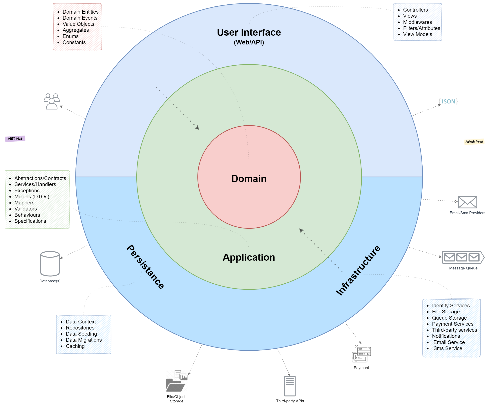

# DPoPWebApp

A modern, decoupled Client-Side Rendered (CSR) architecture featuring a pure .NET backend and a Vite-based Web Component frontend with a custom security layer.

## 📁 Repository Structure

- **`/web`**: A client-side rendered frontend built with **Lit** and **Native Web Standards**.
- **`/api`**: A clean-architecture **.NET 8 Web API** backend.

---

## 🚀 Frontend (`/web`)

Instead of reaching for a heavy CLI-based framework, the frontend implements the core pillars of a modern SPA (Single Page Application) using standard Web Components:

* **Custom Router:** A lightweight, manifest-based navigation engine.
* **Android-Inspired Lifecycle:** An explicit `Bootstrap` and `Manifest` sequence, separating component registration from application logic.
* **Secure by Design:** Integrated **Token Service** and **DPoP (Demonstrating Proof-of-Possession)** validation on the fly.
* **Decoupled State:** Pure JS "Managers" handle business logic (Vault, Session, Auth), keeping the UI components thin and reactive.

### Frontend Project Structure
* `web/index.js`: A minimal entry point that connects the Manifest to the Bootstrap.
* `web/src/Manifest.js`: The "Android Manifest" for your Web Components.
* `web/src/Bootstrap.js`: The application's startup orchestrator.
* `web/src/managers/`: Singleton state providers (The "Source of Truth").
* `web/src/viewmodels/`: The `ViewModel` of each View.
* `web/src/ui/views/`: Top-level routed screens.
* `web/src/ui/components/`: Shared UI elements.

---

## 🏛️ Backend (`/api`)

The .NET backend is built following **Clean Architecture** patterns, separating domain rules from implementation details.

### Clean Architecture Layers


* **Domain**: Enterprise business rules and domain entities.
* **Application**: Application-specific business rules, validations, and services.
* **Infrastructure**: Data access, cache implementation, security integrations.
* **WebApp**: The ASP.NET Core Web API presentation layer, routing controllers, and handling DPoP validation middleware.

---

## ⚙️ How to Run & Configure

### 1. Run the Backend (`/api`)
The backend is an ASP.NET Core API. To run it:
1. Navigate to the `api/WebApp` directory:
   ```bash
   cd api/WebApp
   ```
2. Run the application using the `DevSPA` launch profile (which exposes the API at `http://localhost:54321`):
   ```bash
   dotnet run --launch-profile DevSPA
   ```

### 2. Run the Frontend (`/web`)
The frontend is a Vite-powered application:
1. Navigate to the `web` directory:
   ```bash
   cd web
   ```
2. Install dependencies:
   ```bash
   npm install
   ```
3. Run the development server:
   ```bash
   npm run dev
   ```
   The application will be accessible at `http://localhost:3000`.

---

## 🌐 Environment & API Base Address

Since the frontend is a Client-Side Rendered (CSR) SPA, it uses **build-time environment variables** to bind to different API endpoints based on the deployment mode.

### 📝 Configuration Files
* [web/.env.development](./web/.env.development): Points to `http://localhost:54321/api` (Local Dev Backend).
* [web/.env.staging](./web/.env.staging): Points to the staging API (`https://dpopwebapp.runasp.net/api`).
* [web/.env.production](./web/.env.production): Points to the production API.

> [!IMPORTANT]
> **DPoP HTU Validation Rule**
> The DPoP protocol requires the HTTP Target URI (`htu` claim) to match the API endpoint *exactly*.
> - In development, `VITE_API_BASE_URL` in `.env.development` must point to the absolute URL of the API server (`http://localhost:54321/api`) so that the generated DPoP token's host matches the API server's host.
> - If you configure a relative path (e.g., `/api` via Vite Proxy forwarding), you must also update the backend `BaseUrl` configured in [api/WebApp/appsettings.json](./api/WebApp/appsettings.json) under `JwtAuthEnvironment:Test:BaseUrl` to match the frontend origin (`http://localhost:3000`).

### 📦 Building for Different Environments
Vite loads environment variables based on the `--mode` flag. The CI/CD workflow builds appropriate bundles:
* **Staging Build:**
  ```bash
  npm run build -- --mode staging
  ```
* **Production Build:**
  ```bash
  npm run build -- --mode production
  ```

---

## 🔗 Federated Repo Network
- [DPoP-Demo-Nuxt-3-](https://github.com/YunnnaChen/DPoP-Demo-Nuxt-3-)
- ……


